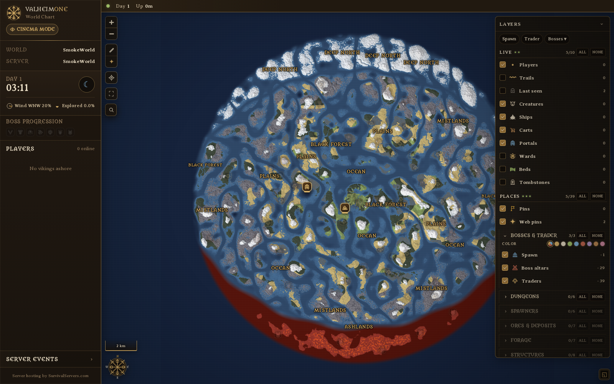
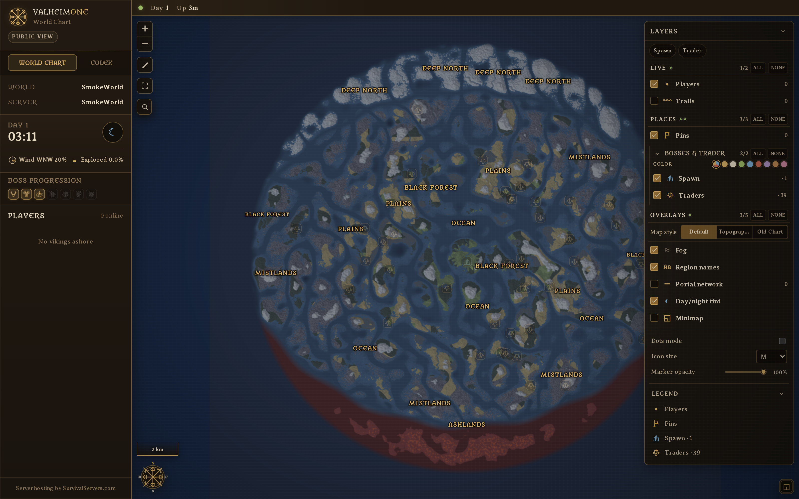
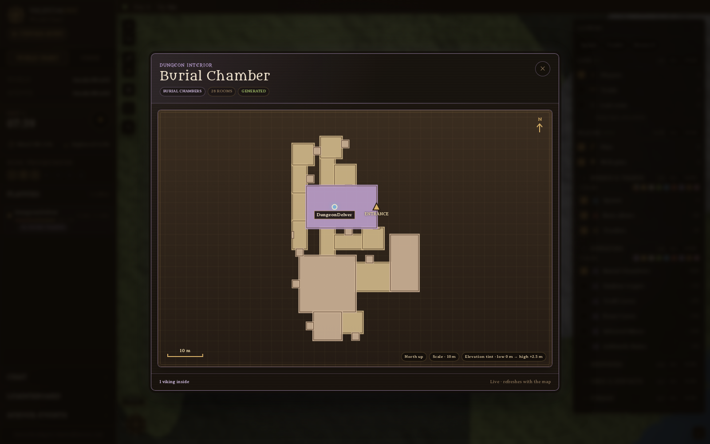
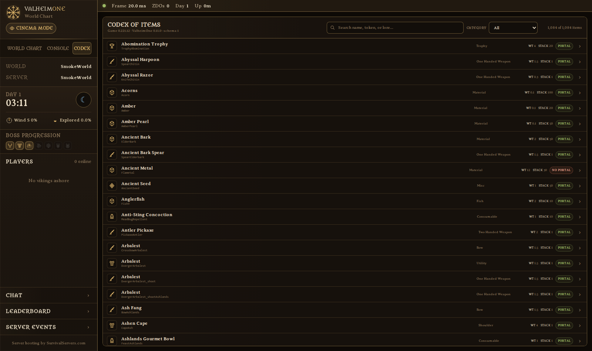
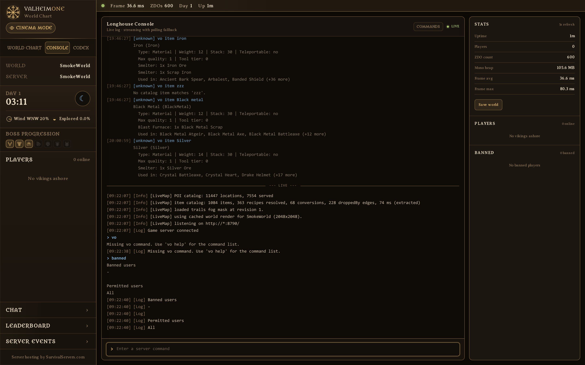
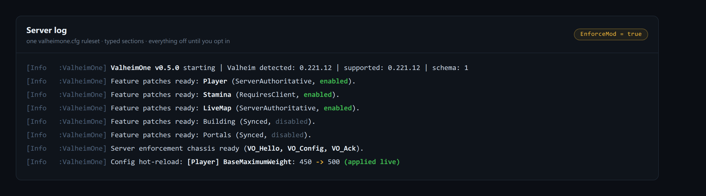

<p align="center">
  <picture>
    <source media="(prefers-color-scheme: dark)" srcset="docs/brand/valheimone-landscape-dark.png">
    
  </picture>
</p>

# ValheimOne

[](LICENSE)
[](https://github.com/BepInEx/BepInEx)
[](https://store.steampowered.com/app/892970/)
[](#features)

Everything your Valheim dedicated server is missing: a live world map you can share with your players, a searchable item codex, a browser admin console, Discord alerts, and server-enforced rules. Server-side only. Your players join with a completely vanilla game.

_ValheimOne is a community project and is not affiliated with or endorsed by Iron Gate Studio._

> **Official Hosting:** [SurvivalServers.com](https://www.survivalservers.com/services/game_servers/valheim/?utm_source=github&utm_medium=readme&utm_campaign=valheim_one) offers managed Valheim dedicated servers with ValheimOne built in.

---

## Table of Contents

- [Features](#features)
- [Installation](#installation)
- [Configuration](#configuration)
- [Getting Help](#getting-help)
- [Contributing](#contributing)
- [License](#license)

---

## Features

### 🗺️ Live World Map

Your whole world in a browser, drawn from the server seed and updating in real time. Players, ships, carts, portals, tombstones, wards and beds move as they happen. Fog-of-war can mirror exactly what your vikings have actually charted.



Turn on the heatmap to see where everyone has been over the last day or week, or open the Sagas leaderboard for playtime, deaths and distance travelled.

### 🔗 Share It With Your Players

Three views, and you decide who gets which. **Admin** sees everything. **Spectator** shows live players and every layer but never grants a single admin action. **Public** is read-only and fog-covered, safe to post in your Discord.



### 🏛️ Look Inside Dungeons

Click any dungeon entrance and get a top-down room schematic read straight from the game's own generated layout, with live players drawn inside it. No more wondering where someone vanished to.



### 📖 Codex of Items

Every one of roughly 1,084 items, searchable and filterable: weight, stack size, tiers, damage, armour, full recipes with station requirements, what drops it, and what it is used to make. Jump straight from an ingredient to everything that needs it.



### 💻 Admin Console In The Browser

A live server log and a command box with history and autocomplete, running whitelisted commands through the game's own console. Kick, ban, save the world, or schedule a graceful shutdown that warns players on the way down.



### ⚙️ Server Rules That Actually Stick

Twenty-six opt-in modules covering carry weight, stamina, food, drops, gathering, build rules, portals, taming, raids, production speeds and more. Everything is off until you turn it on, and most values hot-reload without a restart.

See [docs/gameplay-modules.md](docs/gameplay-modules.md) for the full list.



### 🔔 Discord Alerts

Joins, leaves, deaths with the biome they died in, raids starting and ending, world saves and new days. Point it at a webhook and pick which events you care about.

### 📡 Server Browser Support

A standalone A2S query responder so server browsers, monitoring tools and hosting panels can see your server, including crossplay servers that do not answer A2S on their own. Richer JSON lives at `/api/status` and `/api/players`.

See [docs/query.md](docs/query.md).

---

## Installation

You need a Valheim Dedicated Server with [BepInEx 5.4.x](https://github.com/BepInEx/BepInEx).

1. Download the latest zip from [Releases](https://github.com/HumanGenome/ValheimOne/releases). Take the plugin-only package if you already run BepInEx, or the bundled package for a fresh install.
2. Drop `ValheimOne.dll` into `BepInEx/plugins/`.
3. Start the server. ValheimOne writes `BepInEx/config/valheimone.cfg` on first boot.

```text
Valheim Dedicated Server/
└── BepInEx/
    └── plugins/
        └── ValheimOne.dll
```

Building from source is `./build.sh`; see [RELEASING.md](RELEASING.md) for packaging.

---

## Configuration

Everything lives in one file: `BepInEx/config/valheimone.cfg`. Every gameplay section is off by default, so a fresh install changes nothing until you opt in.

Start the server once to generate the file, then enable the sections you want:

```ini
[Player]

Enabled = true
BaseMaximumWeight = 450
MegingjordBuff = 200
```

Saving the file applies changed values live. Only changes that alter patch topology need a restart.

- Full module list and what each one does: [docs/gameplay-modules.md](docs/gameplay-modules.md)
- Query and status endpoints: [docs/query.md](docs/query.md)

---

## Getting Help

Bugs and feature requests go to [GitHub Issues](https://github.com/HumanGenome/ValheimOne/issues). If you rent your server, hosting and control-panel questions belong with your provider.

---

## Contributing

See [CONTRIBUTING.md](CONTRIBUTING.md).

---

## License

MIT. See [LICENSE](LICENSE).
