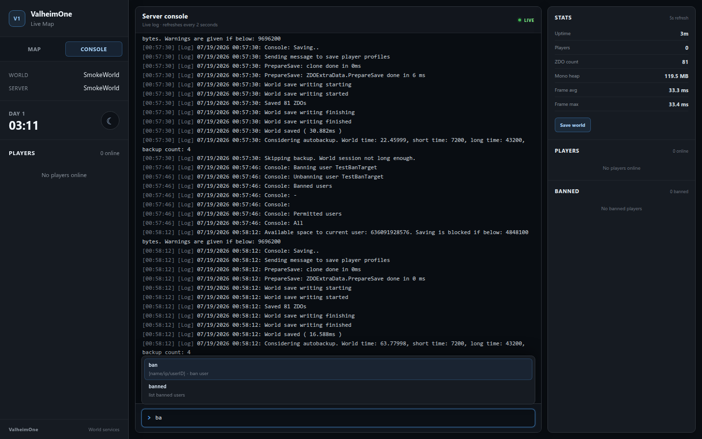
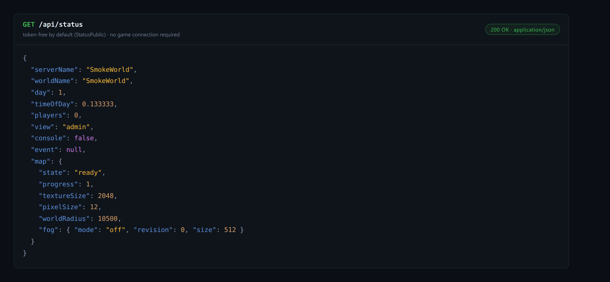

<p align="center">
  <picture>
    <source media="(prefers-color-scheme: dark)" srcset="docs/brand/valheimone-landscape-dark.png">
    
  </picture>
</p>

# ValheimOne

[](LICENSE)
[](https://github.com/BepInEx/BepInEx)
[](https://store.steampowered.com/app/892970/)
[](#features)

Everything your Valheim dedicated server is missing: a live map, a web console, Discord notifications, server-enforced settings, and a server query endpoint — with vanilla-compatible server features and synchronized client features where game ownership requires them.

_ValheimOne is a community project and is not affiliated with or endorsed by Iron Gate Studio._

> **Official Hosting:** [SurvivalServers.com](https://www.survivalservers.com/services/game_servers/valheim/?utm_source=github&utm_medium=readme&utm_campaign=valheim_one) offers managed Valheim dedicated servers with BepInEx support for ValheimOne.

**Status — released.** ValheimOne is available with the server enforcement chassis, twenty-six default-off gameplay modules, the Live Map (world render, players, POIs, pins, fog-of-war, admin and public views), the web admin console, and the standalone A2S query responder. Gameplay features are disabled by default; the `[Server]` transport infrastructure is enabled by default but does not alter gameplay on its own.

---

## Table of Contents

- [Features](#features)
- [Installation](#installation)
- [Using ValheimOne](#using-valheimone)
- [Getting Help](#getting-help)
- [Contributing](#contributing)
- [License](#license)

---

## Features

### Live Map

Builds a procedural world render directly from the server seed, then cuts it into a zoomable Leaflet tile pyramid cached on disk for fast browser navigation. Live player positions (honoring in-game position privacy), points of interest read from world locations, shared map pins, and fog-of-war all update over the generated terrain, with a toggleable Layers panel and low-zoom POI clustering. Updates stream over an `/api/events` Server-Sent-Events feed (with automatic polling fallback), and an opt-in entity layer adds ships, carts, portals, tombstones, wards, beds, and a pulsing ring for active raid events, alongside a default-off Creatures layer that tracks bosses, serpents, and mobs inside an active raid. An on-demand structure survey clusters player-built pieces into a Bases layer that outlines each settlement with its approximate structure count, and admins can tow an unattended ship to a clicked map point, with moves refused while players are nearby or beyond a five-kilometer limit.


The embedded HTTP server serves three view tiers: a token-gated admin view with every layer available, a shared spectator view, and a read-only public view governed by a configurable fog mode — `off`, `trails`, or `explored`, the latter decoding vanilla cartography-table data so the public map reveals exactly what players have charted. A slim map-top strip keeps status, day, and uptime visible in every tier, adding frame time and abbreviated ZDO count for console-authorized admins. Server status and player data are also available as JSON at `/api/status` and `/api/players`.


Map generation and runtime data stay on the server. Players join with fully vanilla clients; the browser map does not require a Valheim client mod.

### Web pins

Collaborative web pins let map viewers mark destinations, resources, and tasks directly from the browser. Checking a pin off keeps it in the shared history instead of deleting it, and changes sync live through the existing SSE feed. `SharedPinEditing` controls whether shared-view visitors can create pins and edit their own, while `PublicWebPins` exposes the pins read-only on the public view. The persistent store keeps up to 100 pins per author and 500 globally, and accepts only the built-in icon whitelist.

### Web Admin Console

Adds a Console tab to the Live Map dashboard (opt-in via `ConsoleEnabled`, admin token required): a live server log with severity colors and resume-scroll, a command input with history and autocomplete that executes whitelisted commands through the game's own console path (`ConsoleWhitelist`, or `AllowAllCommands`), player kick/ban/unban with confirm dialogs, a world-save button, and a stats readout backed by `/api/stats` (uptime, players, ZDOs, Mono heap, frame timings). Destructive shutdown commands receive an additional browser confirmation before they are sent.

Use `vo shutdown <seconds> [message]` from the native or web console to schedule a graceful dedicated-server stop (the delay is clamped to 5–3600 seconds), and `vo shutdown cancel` to cancel it. Players receive server shouts when the countdown is armed and at applicable 60-, 30-, and 10-second marks. At zero, ValheimOne completes a synchronous world and player-profile save before entering Valheim's normal clean-exit path.


The command input autocompletes against the server's whitelist as you type:



### Discord Notifications

The opt-in, server-only `[Discord]` feature sends batched webhook embeds for player joins and leaves, deaths (including the last known biome when available), raid starts and ends, world saves, and new in-game days. Join, leave, death, and raid notifications default on; the noisier world-save and day-change notifications default off. Set `WebhookUrl`, optionally set `ServerDisplayName` (otherwise the world name is used), and enable the section. Changes to the feature gate, URL, display name, and event toggles apply live.

Webhook delivery is isolated to a bounded background worker with HTTPS/TLS 1.2, short timeouts, and limited retries. The webhook URL is treated as sensitive: it is never logged or synchronized to clients, and notification payloads contain only the configured/world display name and event text—not passwords, join codes, connection addresses, platform IDs, or tokens. This feature works independently of the Live Map and Server Query modules.

### Server-Enforced Settings

Uses one `BepInEx/config/valheimone.cfg` file as the server ruleset. Typed sections keep Boolean, integer, float, and percentage settings explicit; every feature has its own `Enabled = false` gate, so installing ValheimOne changes nothing until an operator opts in.

The enforcement chassis exchanges `VO_Hello`, `VO_Config`, and `VO_Ack` over routed RPC. In `[Server]`, `EnforceMod = false` permits vanilla clients; setting it to `true` kicks vanilla or mismatched clients after `HandshakeGraceSeconds`. `[Server]` also carries host-level controls: `MaxPlayers` raises the real player cap beyond Valheim's 10 (join gate and crossplay lobby capacity, works with vanilla clients), and `NoPasswordRequired` lets a public dedicated server start without a join password. `SyncConfig = true` sends compatible clients a chunked, acknowledgement-gated ruleset. Clients apply it as a data-only in-memory overlay, clear it on disconnect, and never receive `ClientOnly` sections. Compatible clients can therefore be hot-enabled by a server config push without installing new patches.


Features use four modes: **server-authoritative** logic runs under server ownership and can support vanilla clients; **synced** logic requires a compatible client and receives the server overlay; **client-only** settings stay local and are never pushed; and **server-only** integrations run only on the host and are never synchronized. The current gameplay modules are:

- `Player` (`[Player]`) — sets carry weight, the Megingjord bonus, auto-pickup range, encumbered pickup, and rested seconds per comfort level. **Mode:** server-authoritative.
- `PlayerStamina` (`[Stamina]`) — scales stamina regeneration, delay, movement drains, and action costs. **Mode:** synced.
- `BuildingQoL` (`[Building]`) — removes structural-support requirements, suppresses ordinary placement blocking, and overrides build reach and rotation step. **Mode:** synced.
- `FoodDuration` (`[Food]`) — scales food duration and can hold benefits at full strength until expiry. **Mode:** synced.
- `ItemTweaks` (`[Items]`) — scales item stack sizes, weights, and maximum durability. **Mode:** synced.
- `ItemDropMultiplier` (`[Drops]`) — scales destructible, creature, and pickable yields. **Mode:** server-authoritative.
- `Gathering` (`[Gathering]`) — applies per-material yield modifiers and adjusts supported non-guaranteed drop chances. **Mode:** server-authoritative.
- `CraftFromChest` (`[CraftFromChest]`) — consumes crafting and optional build costs from nearby accessible containers. **Mode:** synced.
- `StationAutomation` (`[StationAutomation]`) — pulls fuel and processable items from nearby containers for smelter-based stations and fireplaces. **Mode:** synced.
- `DayNightLength` (`[Time]`) — scales or absolutely overrides the full day/night cycle length. **Mode:** synced.
- `Beehive` (`[Beehive]`) — overrides honey production time and storage capacity. **Mode:** synced.
- `Fermenter` (`[Fermenter]`) — overrides fermentation time. **Mode:** synced.
- `SapCollector` (`[SapCollector]`) — overrides sap production time and storage capacity. **Mode:** synced.
- `Wards` (`[Wards]`) — overrides ward protection radius. **Mode:** synced.
- `Portals` (`[Portals]`) — disables portal travel or permits normally restricted inventory. **Mode:** synced.
- `ExperienceRates` (`[Experience]`) — applies global and per-skill experience multipliers. **Mode:** synced.
- `DeathPenalty` (`[DeathPenalty]`) — scales death skill loss or preserves inventory without a tombstone. **Mode:** synced.
- `MapSharing` (`[MapSharing]`) — forces compatible clients to share positions and synchronizes their combined explored-map area. **Mode:** synced.
- `ProductionSpeeds` (`[ProductionSpeeds]`) — overrides production time, queue size, and fuel capacity across smelters, blast furnaces, kilns, windmills, spinning wheels, and eitr refineries. **Mode:** synced.
- `CookingStation` (`[CookingStation]`) — scales cook speed, optionally bypasses the fire requirement, and auto-feeds fuel and raw food from nearby containers. **Mode:** synced.
- `FireSource` (`[FireSource]`) — makes torches and fires infinite. **Mode:** synced.
- `StructuralIntegrity` (`[StructuralIntegrity]`) — disables weather damage and reduces support loss by material. **Mode:** synced.
- `ContainerSizes` (`[ContainerSizes]`) — overrides chest, cart, karve, and longship grid sizes with an item-safe shrink guard. **Mode:** synced.
- `Tames` (`[Tames]`) — applies taming, growth, and procreation rate modifiers. **Mode:** synced.
- `WorldEvents` (`[Events]`) — controls raid chance and interval, disables raids, and overrides guardian-power duration and cooldown. **Mode:** server-authoritative.
- `Trader` (`[Trader]`) — multiplies trader buy prices. **Mode:** synced.

**Client-only:** n/a; no current gameplay module uses this mode.

### Server Query / Status

The opt-in `[Query]` feature runs a standalone A2S-compatible (Source Engine Query) UDP responder for server browsers, monitoring tools, and hosting panels, including crossplay servers that do not answer A2S natively. It works independently of the Live Map and defaults to the game port plus 4 (`QueryPort = 0`), avoiding Valheim's own game-port-plus-1 Steam query listener on non-crossplay servers.

A2S_INFO reports the live server and world names, game and version details, password state, live player count, configured maximum players, game port, ValheimOne version keyword, and Valheim's game ID. A2S_PLAYER reports connected player slots; names default to private, generic `Player N` labels unless `PublicPlayerNames = true`.

When the Live Map is enabled, its embedded HTTP server also exposes the richer `/api/status` and `/api/players` JSON surfaces. `/api/status` stays available without a token by default (`StatusPublic`) for hosting-panel queries; see [docs/query.md](docs/query.md).



---

## Installation

ValheimOne requires a Valheim Dedicated Server with [BepInEx 5.4.x](https://github.com/BepInEx/BepInEx) installed.

Download the latest release zip from [GitHub Releases](https://github.com/HumanGenome/ValheimOne/releases). Choose the plugin-only package for a server that already has BepInEx installed, or the full BepInEx-bundled package for a new installation.

Alternatively, build ValheimOne from source:

```bash
./build.sh
```

Release zips (a plugin-only package and a full BepInEx-bundled package) are produced by `tools/package-release.sh`; see [RELEASING.md](RELEASING.md).

The build produces `src/ValheimOne/bin/Release/net472/ValheimOne.dll`. Copy that file into the dedicated server's `BepInEx/plugins/` directory:

```text
Valheim Dedicated Server/
└── BepInEx/
    └── plugins/
        └── ValheimOne.dll
```

Start the dedicated server normally. ValheimOne loads through BepInEx and creates `BepInEx/config/valheimone.cfg` on first boot.

---

## Using ValheimOne

### Configure the Server Ruleset

1. Start the dedicated server once so ValheimOne writes `BepInEx/config/valheimone.cfg` with documented defaults.
2. Stop the server and open the configuration file.
3. Enable only the feature sections you want and set their typed values.
4. Start the server again to apply the ruleset.

Every gameplay section is opt-in. The `[Server]` infrastructure section is the sole default-on exception. Sections include `[Player]` for carry weight, `[Stamina]` for stamina regeneration and costs, and `[Time]` for day/night length. This `[Player]` example raises base carry weight to 450 and changes the Megingjord bonus to 200:

```ini
[Player]

Enabled = true
BaseMaximumWeight = 450
MegingjordBuff = 200
```

`BaseMaximumWeight` is the absolute unmodified carry limit; `MegingjordBuff` is the absolute bonus applied when the belt is active. Their Valheim defaults are 300 and 150 respectively.

Configuration edits hot-reload: saving `valheimone.cfg` applies changed values live (debounced, with a per-key diff logged), and server-pushed overlay values keep precedence. Only changes that alter patch topology still require a restart.

---

## Getting Help

For ValheimOne bug reports and feature requests, use [GitHub Issues](https://github.com/HumanGenome/ValheimOne/issues). If you play through a hosting provider, contact that provider's support for hosting or control-panel questions. SurvivalServers customers: for hosting or control-panel questions, contact SurvivalServers support; for ValheimOne bugs, [GitHub Issues here](https://github.com/HumanGenome/ValheimOne/issues) works too.

---

## Contributing

See [CONTRIBUTING.md](CONTRIBUTING.md).

---

## License

MIT. See [LICENSE](LICENSE).
